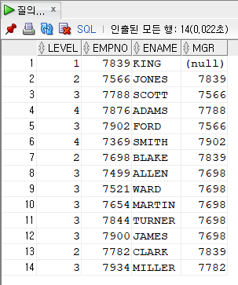
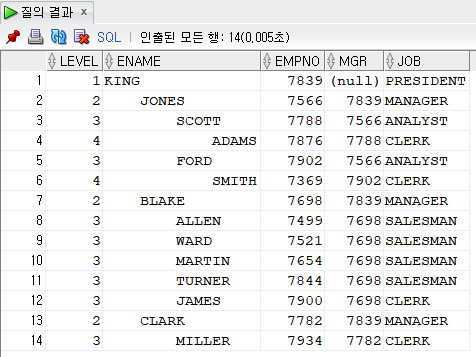
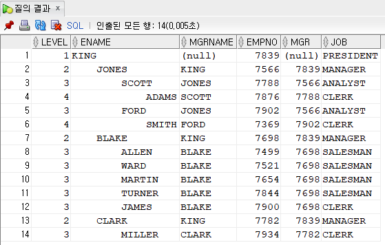
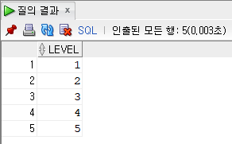

계층 구조 쿼리
=====
계층 구조는 하이라키(Hierarchy) 혹은 트리(Tree) 구조라고 불린다.
- - -
## 목차
1. [상황](#상황)
2. [쿼리](#쿼리)
	* [기본구문](#기본구문)
	* [자세히](#자세히)
3. [레퍼런스](#레퍼런스)

## 상황
* `계층 구조 쿼리` 사용 가능한 상황(아래 각 두 상황이 OLTP와 OLAP에 따라 나뉜 상황인지 **확인**)
	* 한 테이블에 UPPER 컬럼(예를 들어 empno의 UPPER 컬럼은 mgrno)이 있을 때
	* Snowflake 모델
		* 데이터 마트(데이터 웨어하우스?) 구성 시 차원 테이블(Dim) 관련 설계
* 흔히 접할 수 있는 예(요구상황)
	* 년-월-일
	* 지역-국가-시/도-군/구

##### [목차로 이동](#목차)

## 쿼리

### 기본구문

* 예1. PRESIDENT 직업을 기준으로 계층 구조로 조회하는 예
	* 쿼리문  
		```sql
		SELECT LEVEL
			, empno
			, ename
			, mgr
		FROM emp
		START WITH job = 'PRESIDENT'
		CONNECT BY PRIOR empno = mgr;
		```
	* 실행결과  
		 
* 예2. `LEVEL Pseudocolumn`을 이용하면 위 계층구조 쿼리를 좀 더 눈에 들어오도록 표현 가능
	* 쿼리문  
		```sql
		SELECT LEVEL
			, LPAD('    ', 4 * (LEVEL - 1)) || ename ename
			, empno
			, mgr
			, job
		FROM emp
		START WITH job = 'PRESIDENT'
		CONNECT BY PRIOR empno = mgr;
		```
	* 실행결과  
		

위 예를 바탕으로 계층구조 쿼리의 Syntax 및 실행순서를 정리해보면 아래와 같다.  

* Syntax
	* START WITH
		* 계층 질의의 루트(부모 `행`)로 사용될 `행`을 지정
	* CONNECT BY
		* 계층 질의에서 상위계층(부모 `행`)과 하위계층(자식 `행`)의 관계 규정
		* [PRIOR 연산자](#PRIOR-연산자)와 함께 사용
			* `CONNECT BY PRIOR 자식컬럼 = 부모컬럼`: 부모에서 자식으로 트리구성(Top Down)
			* `CONNECT BY PRIOR 부모컬럼 = 자식컬럼`: 자식에서 부모로 트리구성(Bottom Up)
	* LEVEL Pseudocolumn
		* 계층구조 쿼리에서 수행결과의 Depth를 표현하는 의사컬럼
		* [CONNECT BY LEVEL](#CONNECT-BY-LEVEL)
	* ORDER SIBLINGS BY
		* 계층구조 쿼리에서 편하게 정렬작업 가능하게 함
* 실행순서
	* 첫째. `START WITH` 절
	* 둘째. `CONNECT BY` 절
	* 셋째. `WHERE` 절
	
##### [목차로 이동](#목차)

### 자세히
#### PRIOR 연산자
* PRIOR 연산자란
	* PRIOR 연산자는 상위행의 컬럼을 나타낸다.
	* 이는 CONNECT BY 절에서만 사용할 수 있는 것이 아니다.
* 쿼리  
	```sql
	SELECT LEVEL
		, LPAD('    ', 4 * (LEVEL - 1)) || ename ename
		, PRIOR ename mgrname
		, empno
		, mgr
		, job
	FROM emp
	START WITH job = 'PRESIDENT'
	CONNECT BY PRIOR empno = mgr;
	```
* 실행결과  
	

##### [목차로 이동](#목차)

#### CONNECT BY LEVEL

* 쿼리문  
	```sql
	SELECT LEVEL
	FROM dual
	CONNECT BY LEVEL <= 5;
	```
* 실행결과  
	

[CONNECT BY LEVEL](http://wiki.gurubee.net/pages/viewpage.action?pageId=27427825) 구문에 원리와 활용에 대해서는 더 공부해야 한다.
	
##### [목차로 이동](#목차)

## 레퍼런스
* [Oracle Advanced SQL - 계층구조 쿼리란](http://www.gurubee.net/lecture/1300)
* [Oracle의 계층 질의 처리 방법](https://docu94.tistory.com/70)

##### [목차로 이동](#목차)