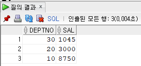

Row-oriented Database
=====
SQL의 핵심인 GROUPING, 즉 집계를 잘 이해하기 위해서 이 기본 특성을 제대로 이해하는 게 중요하다는 생각이 들었다.
- - -
## 목차
1. [비교](#비교)
2. [파일 시스템](#파일-시스템)
3. [참고문헌](#참고문헌)

## 비교
> Oracle Database is a row format database.  

[아래와 같이](http://www.gurubee.net/lecture/1028) 하나의 칼럼(`sal`)에 대해 서로 다른 집계함수를 사용(`READ`)할 수 있는 이유는 행 지향 데이터베이스이기 때문이라고 생각한다(**열 지향 확인 필요**).  

* 쿼리  
	```sql
	SELECT deptno
		, DECODE(deptno, 10, SUM(sal)
			, 20, MAX(sal)
			, 30, MIN(sal)) sal
	FROM emp
	GROUP BY deptno;
	```
* 실행결과  
	 

본론으로 들어가서 행 지향과 열 지향의 특징을 비교해본다.  
	
Row oriented | Column oriented
------------ | ---------------
읽기/쓰기 빠름 | 읽기/쓰기 (행 지향에 비해) 느림
OLTP(운영계) | OLAP(분석계)
조회 느림(불필요한 데이터 조회) | 조회 빠름

* The major difference in both the datastores lies in the way they physically store the data on the disk.
	* 행 지향 DB는 동일한 `블록`에 전체 행을 저장(`WRITE`)하려고 시도하지만  
	* 컬럼 지향 DB는 동일한 블록에 후속 열의 값을 저장한다

##### [목차로 이동](#목차)

## 파일 시스템
이 파트는 객관적인 내용은 아니고, 회사 세미나(주제: `파일 시스템`) 중 들은 내용으로 나중에 더 찾아볼 포인트들을 남겨놓기 위해 기록한다(오류 있을 수 있음).  

* [파일 시스템](https://terms.naver.com/entry.nhn?docId=1221306&cid=40942&categoryId=32828)이란
	* 세미나의 주제였는데, 처음에 듣고 파일 또는 DB라고 추상적으로 생각함
	* 파일 시스템이란 저장, 검색, 조회를 위한 체계 혹은 프로토콜
		* 컴퓨터에서 데이터를 기록하기 위해선 미리 하드디스크드라이브에 읽고, 쓰고, 찾기 위한 `준비`가 전제되어야 함
		* 이 `준비`의 규칙이 바로 파일 시스템
		* 도스나 윈도, 매킨토시, 유닉스 등 모든 OS가 파일 시스템을 반드시 갖추고 있음
* 데이터베이스(DB)의 도래
	* 이기종 OS간 파일 공유 불가
	* DB 등장 계기 됨
* 데이터 마트(DM) 성능 하락
	* 데이터가 쌓이면 데이터 마트의 성능 하락 경우 존재
	* 두 가지 측면에서 접근 가능
		* WRITE
			* Page([비교](#비교)에서 `블록`과 같은 개념으로 저장시 최소 단위로 이해)의 Split 최소화
		* READ
			* Block I/O
			* Cache

우리 회사는 OLAP 분야(?)에 속하므로 `데이터 마트의 성능 하락`이 결국 진짜 주제였다. 발표자는 성능 하락 요인의 90%는 WRITE에 있다고 주장했다. 데이터가 입력됨에 따라 최소 단위인 PAGE의 SPLIT(재정렬)이 발생하고, DEPTH가 기하급수적으로 증가한다는 것이다. 이걸 줄이려면 데이터가 입력되기 전에 공간을 마련해놓는 것이 한 방법일 수 있다고 했다. 실제로 최근에는 하드 디스크의 가격이 많이 내려갔으니 이 부분(논리적인 부분이 아니라 물리적인 설계)을 고려해 데이터 마트를 설계하는 것이 개발자의 역할이라고 했다.  

이에 대한 반박으로 최근에는 예전처럼 물리적인 부분은 최적화 되어 있어 개발자가 건드릴 게 없으며(또한 서버에 사용하는 디스크의 가격은 비쌈) READ 부분, 즉 쿼리 튜닝이 유일하게 해야 할 부분이라고 했다. 월별 누적 같은 경우, PARTITION별로 구성해서 설계하는 식으로 부하를 줄인다는 것이다.  

하지만 PARTITION 개념은 예전에도 있었다며 재반박이 들어왔는데 실무자와 영업의 입장 차이인지, 실제 깊이의 차이인지 좀 더 찾아봐야 할 것 같다.  

이외에 나온 얘기는 ORACLE HINT, CACHE 관련 유투브 해시 알고리즘이 자동 추천과 관계가 있고, INDEX와 ADDRESS의 관계 등이 언급됐다.

* 기타
	* DW란(혹은 ODS?)
		* OLTP, 즉 RDB 전체 테이블 데이터를 조인해서 한 뭉치로 가져온 것으로 생각해도 되나?
	* 16진수?

##### [목차로 이동](#목차)

## 참고문헌
+ [DBMS|Row oriented vs. column oriented data stores](https://www.geeksforgeeks.org/dbms-row-oriented-vs-column-oriented-data-stores/)
+ [Rowise vs. Columnar Database? Theory and in Practice](https://medium.com/@mangatmodi/rowise-vs-columnar-database-theory-and-in-practice-53f54c8f6505)
+ [Oracle|Question](https://asktom.oracle.com/pls/asktom/f?p=100:11:0::::P11_QUESTION_ID:9530427800346499360)
+ [Wiki](https://en.wikipedia.org/wiki/Column-oriented_DBMS)

##### [목차로 이동](#목차)